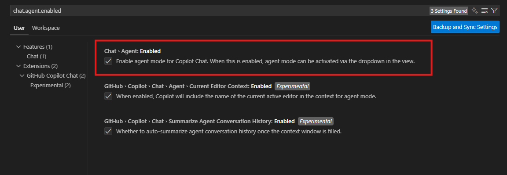
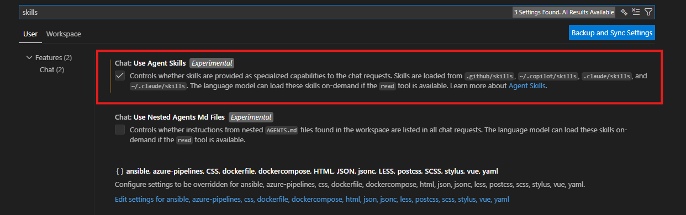

# CLAP AI Setup Guide

## Verification Required

All code generated should be thoroughly reviewed and tested before implementation. The AI may not account for specific project requirements or environments.

## Overview

This repository provides a skill for AI agents to generate Elasticsearch logs reports for the CLAP platform.

**Key Capabilities**

- **Automated Log Analysis**: AI agents query Elasticsearch and generate comprehensive Markdown reports
- **Real-time Reporting**: Generate analytics for applications and Space CLOUD scheduler logs
- **Reduced Manual Effort**: Automate tedious log queries and report generation tasks

---

## Prerequisites

### Visual Studio Code

- Version **1.108 or above** is required
- Latest version is recommended for optimal performance

### GitHub Copilot Chat

- Ensure Agent Mode is enabled for code editing
  - If unavailable, enable by setting `chat.agent.enabled` in VS Code settings (Ctrl + ,)

  

- **Enable Agent Skills** (required for this skill to work):
  - Enable by setting `chat.useAgentSkills` in VS Code settings (Ctrl + ,)
  - This allows VS Code to automatically load skills from the `.github/skills` folder

  

- Start a new Copilot Chat session before using this skill

### LLM Model Suggestion

- **Recommended**: Use **Claude Opus 4.5** or above

---

## Setup Instructions

### Step 1: Clone This Repository

```bash
git clone <repo-url>
cd ai-clap-mcp
```

### Step 2: Configure Elasticsearch Credentials

Copy `.env.example` to `.env` and fill in your credentials:

```bash
cp .env.example .env
```

Edit `.env` with your values:

- `ES_CLAP_APIKEY` - Your Elasticsearch API key (required)
- `ES_PROXY` - Corporate proxy URL (optional, only if behind firewall)
- `ES_URL` - Elasticsearch endpoint (optional, uses default SIT environment if not set)

### Step 3: Configure Copilot Chat

1. Start a new Copilot Chat session in VS Code
2. Ensure Agent Mode is active

---

## How to Use This Skill

### Using the Skill with Copilot Chat

Ask your AI agent to perform Elasticsearch log analysis tasks:

**Example Prompts:**

- _"Generate a logs report for <your-app> from the last 7 days"_
- _"Analyze API endpoint performance for the last month and generate statistics"_
- _"Create a report showing login activity and unique users for <your-app>"_

### What the AI Agent Can Do

- Query Elasticsearch for application logs
- Fetch and aggregate log data by various filters
- Generate comprehensive Markdown reports with:
  - Log statistics (counts, trends, daily averages)
  - User activity analysis (unique users, login counts)
  - API endpoint performance metrics
- Save reports to the `reports/` directory
