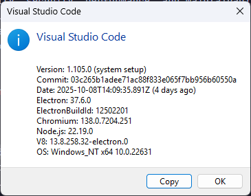
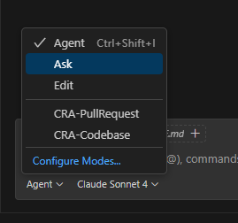
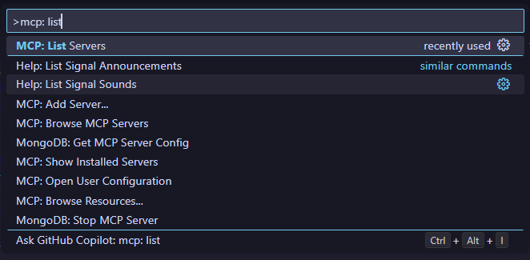
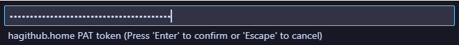
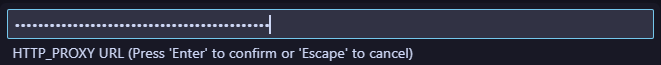
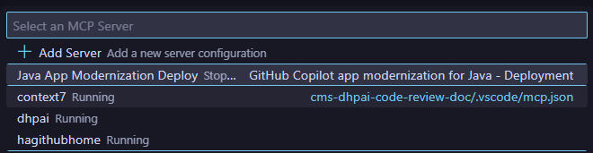
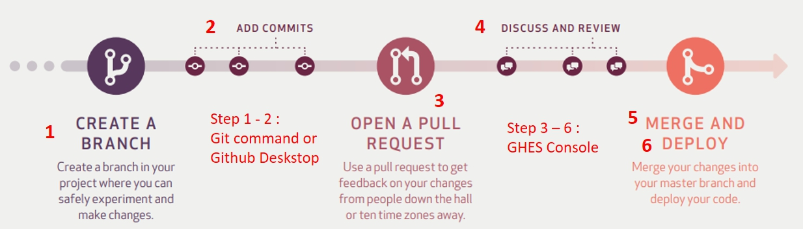

# Code Review Agent (CRA) with GitHub Copilot Chat

> [!Important]
> **Validation Required:** All code generated should be thoroughly reviewed and tested before implementation. The AI may not account for specific project requirements or environments.

## Overview

This document provides comprehensive guidance for setting up an AI-driven code review agent that supports two distinct workflows for code analysis and review. The agent leverages GitHub Copilot Chat in agent mode to streamline development workflows and improve code quality.

**Workflow A - Branch Comparison & Pull Request Creation:**

- Compares differences between two Git branches (e.g., feature branch vs main)
- Analyzes code changes and provides detailed review comments
- Automatically creates pull requests with comprehensive review insights
- Highlights potential issues, security concerns, and improvement suggestions
- Streamlines the merge process with intelligent code analysis

**Workflow B - Comprehensive Codebase Review:**

- Generates comprehensive code reviews from multiple aspects and perspectives
- Analyzes entire codebase for quality, security, performance, and maintainability
- Identifies patterns, architectural concerns, and cross-cutting issues
- Provides strategic recommendations for codebase improvement with prioritized action items
- Generates an actionable list in Excel format for developers to follow up on recommendations

Both workflows integrate seamlessly with GitHub repositories and VS Code, providing developers with AI-powered code review capabilities that enhance code quality and accelerate development cycles.

## Pre-requisites

1. Visual Studio Code: Version 1.105 and above

   # 

2. Model Subscription: Claude Sonnet 4 (copilot) subscription
3. [GitHub MCP Server](https://github.com/github/github-mcp-server) is installed and available in your PATH
4. Node.js and npm are available (for npx commands)

## Setup

## Step 1: Import into your project

### For New Project (Quick Setup)

**Use Case:** Starting a fresh project or repository without existing VS Code configurations.

**Steps:**

1. Clone this GitHub repository to a new directory on your local machine:

   ```bash
   git clone <this-repo-url> code-review-agent
   ```

2. Copy both `.github` and `.vscode` folders to your project root directory
3. Your project structure should now include:

   ```plain
   your-project/
   ├── .github/
   │   └── chatmodes/
   │       ├── CRA-PullRequest.chatmode.md
   │       └── CRA-Codebase.chatmode.md
   └── .vscode/
       └── settings.json (with MCP configurations)
   ```

### For Existing Project (Manual Integration)

**Use Case:** Adding Code Review Agent to an existing project that may already have VS Code configurations.

**Steps:**

1. Clone this GitHub repository to a temporary directory:

   ```bash
   git clone <this-repo-url> temp-cra-setup
   ```

2. **Copy Chat Modes:**
   - Copy the `.github/chatmodes` folder to your project root
   - If you already have a `.github` folder, merge the `chatmodes` folder into it

3. **Merge VS Code Settings:**

   **Option A: If you don't have `.vscode/settings.json`**
   - Copy the entire `.vscode` folder to your project root

   **Option B: If you already have `.vscode/settings.json`**
   - Manually merge the following essential settings from this repo's `.vscode/settings.json` into your existing file:

   ```json
   {
   	// Chat and Agent Configuration
   	"chat.enabled": true,
   	"chat.commandCenter.enabled": true,
   	"chat.agent.maxRequests": 1000,
   	"chat.todoListTool.enabled": true
   }
   ```

   **Important Merge Guidelines:**
   - **Preserve Existing Settings:** Don't overwrite your existing VS Code configurations
   - **Add Missing Sections:** Only add the chat and MCP configurations if they don't exist
   - **Avoid Duplicates:** If you already have MCP servers configured, only add the ones you need
   - **Validate JSON:** Ensure your merged `settings.json` remains valid JSON syntax

4. **Clean Up:**
   - Delete the temporary directory: `rm -rf temp-cra-setup`
   - Restart VS Code to apply the new configurations

### Verification

After completing either setup method:

1. **Verify Chat Modes:**
   - Open VS Code in your project directory
   - Check that `CRA-PullRequest` and `CRA-Codebase` appear in the chat mode dropdown

   # 

2. **Verify Settings:**
   - Open VS Code settings (`Ctrl+,` or `Cmd+,`)
   - Search for "chat.enabled" and confirm it's set to `true`
   - Search for "mcp.servers" and verify the required servers are configured

3. **Test Configuration:**
   - Try switching to one of the CRA chat modes
   - The mode should load without errors (MCP servers will be started in Step 2)

### Troubleshooting

- **Chat modes not appearing:** Ensure `.github/chatmodes` folder is in your project root
- **Settings not applied:** Restart VS Code after modifying `settings.json`
- **JSON syntax errors:** Use VS Code's built-in JSON validation to check your `settings.json`
- **Permission issues:** Ensure you have write access to your project directory

## Step 2 : MCPs and Environment Variables

For existing project or new project, follow the below steps to setup and verify MCPs and environment variables.

### MCP

1. **MCP Setup** - Configure the required MCP servers for the Code Review Agent:

   **Option A: For projects without existing MCP configuration**
   - Copy the `.vscode` folder to your project root to automatically set up all required MCP servers

   **Option B: For projects with existing MCP configuration**
   - Manually add the required MCP servers to your existing `.vscode/mcp.json` file
   - Merge the following MCP server configurations into your existing `"servers"` section:

   ```json
   {
   	"servers": {
   		"hagithubhome": {
   			"type": "stdio",
   			"command": "github-mcp-server",
   			"args": ["stdio"],
   			"env": {
   				"GITHUB_HOST": "https://hagithub.home",
   				"GITHUB_PERSONAL_ACCESS_TOKEN": "${input:HAGITHUB_HOME_PAT}"
   			}
   		},
   		"context7": {
   			"type": "stdio",
   			"command": "npx",
   			"args": ["-y", "@upstash/context7-mcp@latest"],
   			"env": {
   				"HTTP_PROXY": "${input:http-proxy}",
   				"HTTPS_PROXY": "${input:http-proxy}",
   				"NO_PROXY": ".server.ha.org.hk,.home"
   			}
   		},
   		"dhpai": {
   			"type": "sse",
   			"url": "https://dhpai-context-mcp-poc-cms-dhp-1.tstcld61.server.ha.org.hk/sse"
   		}
   	}
   }
   ```

   **Important Notes:**
   - Only add the MCP servers you don't already have configured
   - Preserve your existing MCP server configurations
   - The `${input:...}` placeholders will prompt for values when the servers are first started
   - Restart VS Code after modifying MCP server configurations

2. **Start Required MCP Servers** - Initialize the MCP servers needed for the Code Review Agent:
   - Open VS Code Command Palette (`Ctrl+Shift+P` or `Cmd+Shift+P`)
   - Run `MCP: List Servers` to see all configured MCP servers
     
   - **Start the following required servers** by clicking on each one:
     - **hagithubhome** - For GitHub repository operations and pull request creation
     - **context7** - For enhanced code analysis and context understanding
     - **dhpai** - For HA-specific code review and compliance checks
   - When starting each server for the first time, you'll be prompted to provide:
     - **HAGITHUB_HOME_PAT**: Your GitHub Personal Access Token with repository access
       
     - **HTTP_PROXY**: Corporate proxy settings if required (format: `http://<corpID>:<password>@proxy.ha.org.hk:8080`)
       

3. **Verify MCP Server Status** - Confirm all required servers are running properly:
   - Run `MCP: List Servers` again from the Command Palette
   - Verify the following servers show as **active and connected**:
     - ✅ **hagithubhome** - GitHub operations
     - ✅ **context7** - Code analysis and standards
     - ✅ **dhpai** - HA compliance checks
       

   **Troubleshooting:**
   - If a server shows as disconnected, try restarting it from the MCP server list
   - If input prompts don't appear, check that the `${input:...}` syntax is correct in your configuration
   - Ensure you have the necessary network access and credentials for each service

## Usage

The Code Review Agent (CRA) supports two distinct workflows depending on your code review needs. Choose the appropriate chatmode based on your requirements:

### Workflow A: Branch Comparison & Pull Request Creation (CRA-PullRequest)

**Use Case:** When you want to compare changes between two branches and optionally create a pull request.

**Steps:**

1. Ensure you're in your feature or development branch
2. After completing development of a feature, switch to `CRA-PullRequest` chatmode in VS Code
   
3. Type "start" and press the start button
4. The agent will display a table of available branches sorted by last commit date
5. Provide two branch names to compare (e.g., `feature-branch` vs `main`)
6. The agent will:
   - Fetch and analyze the diff between the specified branches
   - Provide detailed code review comments for each changed file
   - Generate an overall assessment and recommendation
7. Optionally, when prompted, choose to create a pull request with the review summary
8. Review the suggestions and improve your code if you agree with the recommendations
9. Switch back to your original chatmode to continue development
10. To re-run the analysis, type "re-run" and press the start button

### Workflow B: Comprehensive Codebase Review (CRA-Codebase)

**Use Case:** When you need a thorough review of the entire codebase or specific pull requests for quality assurance.

**Steps:**

1. Switch to `CRA-Codebase` chatmode in VS Code
2. Type "start" and press the start button
3. The agent will display all available branches sorted by last commit date
4. Select the branch you want to review from the list
5. The agent will:
   - Check out the selected branch
   - Gather context from HA and public coding standards
   - Perform comprehensive analysis across multiple dimensions:
     - Code quality and maintainability
     - Security and compliance assessment
     - Performance and scalability review
     - Testing and documentation evaluation
6. Receive a detailed report with:
   - Categorized findings by severity (Critical, High, Medium, Low)
   - Actionable recommendations with specific file links
   - Security and compliance assessment
   - Prioritized action items for follow-up
7. Use the clickable file links to navigate directly to areas requiring attention
8. Switch back to your original chatmode when review is complete

### Key Differences

| Aspect              | CRA-PullRequest                          | CRA-Codebase                       |
| ------------------- | ---------------------------------------- | ---------------------------------- |
| **Scope**           | Diff between two branches                | Entire codebase or specific branch |
| **Output**          | Branch comparison + optional PR creation | Comprehensive quality assessment   |
| **Use Case**        | Feature completion & merge preparation   | Quality assurance & code audit     |
| **Time Investment** | Quick (5-15 minutes)                     | Comprehensive (15-45 minutes)      |

### Tips for Effective Usage

- **Before Starting:** Ensure all required MCP servers are running (hagithubhome, context7, dhpai)
- **Branch Selection:** Use descriptive branch names for better analysis context
- **Review Scope:** Choose CRA-PullRequest for focused changes, CRA-Codebase for broader quality checks
- **Follow-up:** Address critical and high-priority findings before merging or deploying
- **Documentation:** Keep the generated review reports for future reference and team learning

## Reference GitHub Workflow



## DHP AI MCP References

_Last Update: 5 Nov 2025_

### Spring Boot

- **HPA Setting**: https://sites-isd.home/knowledge/group/private-cloud-portal/environment-basic-cdc/#block58934
- **eAPM Setup**: https://hateams.home/knowledge/group/SC4/eapm-how-to/
- **Naming Convention**: http://cnaf.home/Cloud%20Native%20Application%20Framework/Platform%20Pattern/PaaS%20Standard%20&%20Guideline/Naming_Convention.html
- **Sample Docker with Image**: https://hateams.home/knowledge/group/SC4/openjdk/
- **CLAP**: https://hateams.home/knowledge/group/SC4/clap-how-to/

#### ha-spring-boot

- **POM/Version**: https://hagithub.home/CHASSIS/ha-spring-boot-starter/wiki
- **Exception Handling**: https://hagithub.home/CHASSIS/ha-spring-boot-starter/wiki/Module-Core#exception-handling
- **Logging / CLAP Setup**: https://hagithub.home/CHASSIS/ha-spring-boot-starter/wiki/Module-Core#logging
- **SAM3**: https://hagithub.home/CHASSIS/ha-spring-boot-starter/wiki/Module-Security
- **Healthcheck / Empty Project**: https://hagithub.home/CHASSIS/ha-spring-boot-starter/wiki/Quick-Start#create-an-empty-project
- **Lombok**: https://hagithub.home/CHASSIS/ha-spring-boot-starter/wiki/Quick-Start#create-an-empty-project
- **Add Default Properties**: https://hagithub.home/CHASSIS/ha-spring-boot-starter/wiki/Quick-Start#create-an-empty-project
- **OpenAPI Swagger**: https://hagithub.home/CHASSIS/ha-spring-boot-starter/wiki/Quick-Start#create-an-empty-project
- **JacksonConfig**: https://hagithub.home/CHASSIS/ha-spring-boot-starter/wiki/Quick-Start#create-an-empty-project
- **Rest Client, HttpClient, FeignClient**: https://hagithub.home/CHASSIS/ha-spring-boot-starter/wiki/Quick-Start#create-an-empty-project
- **Controller/Service/Repository Template**: https://hagithub.home/CMSCHASSIS/cms-svc-template

### React

- **reactjs-cmschassis**: https://react-ui-cmschassis-dev-st.tstcld61.server.ha.org.hk/?path=/story/overview--overview
