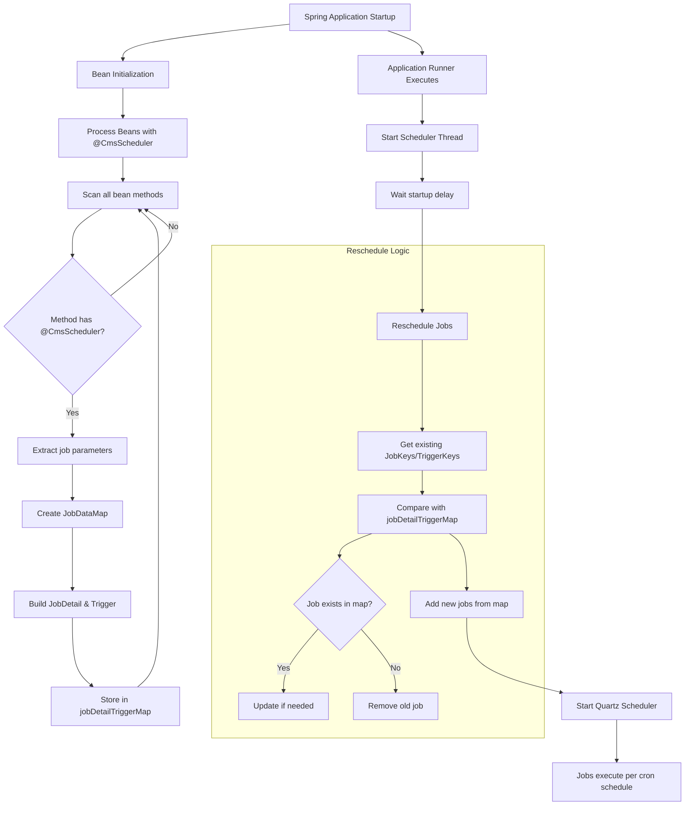
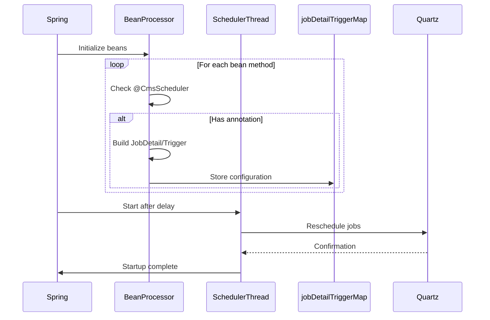
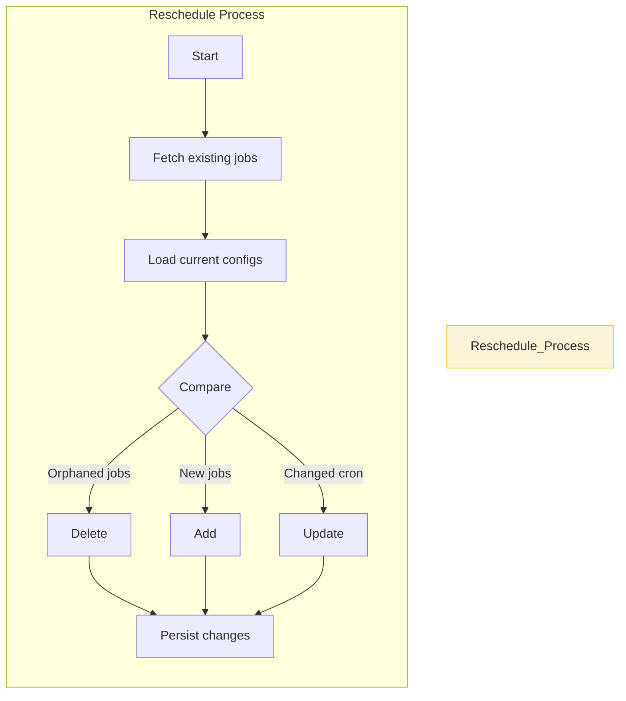
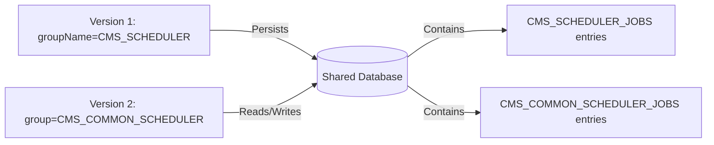

# Frequently Asked Questions (FAQ)

## Q: Does the Common Scheduler support `@Async` for long-running API calls?
**Answer**: The Common Scheduler supports multithreading and concurrent execution but does not support the use of `@Async`. To achieve concurrency, you can adjust the `thread_count` in the `application.yaml` file or set the `concurrent` flag in the scheduling job configuration.

Using the Java `@Async` annotation may result in unsupported behavior.

---
<details>
<summary>Example 1: `@Async` will be ignored if the scheduled job is not set to run asynchronously</summary>
<table>
  <tr>
    <th style="text-align: left;">Description</th>
  </tr>
  <tr>
    <td style="text-align: center;">
      
      
    </td>
  </tr>
</table>
</details>
---

<details>
  <summary>Example 2: Scheduled jobs will return immediately, and the scheduler job result will not be captured when the `@Async` call returns</summary>
  <table>
    <tr>
      <th style="text-align: left;">Description</th>
    </tr>
    <tr>
      <td style="text-align: center;">
        
        
      </td>
    </tr>
  </table>
</details>

## Q: What is the cron expression format?
**Answer**: The cron expression format for a scheduling job consists of six or seven fields separated by spaces. The fields represent the following:

| Field         | Mandatory | Allowed Values        | Special Characters |
|---------------|-----------|-----------------------|--------------------|
| Seconds       | Yes       | `0-59`               | `, - * /`         |
| Minutes       | Yes       | `0-59`               | `, - * /`         |
| Hours         | Yes       | `0-23`               | `, - * /`         |
| Day of Month  | Yes       | `1-31`               | `, - * ? / L W C` |
| Month         | Yes       | `1-12` or `JAN-DEC`  | `, - * /`         |
| Day of Week   | Yes       | `1-7` or `SUN-SAT`   | `, - * ? / L C #` |
| Year (Optional) | No      | `1970-2099`          | `, - * /`         |

*Example Cron Expressions:*
1. `0 0 12 * * ?` - Executes at 12:00 PM every day.
2. `0 15 10 ? * MON-FRI` - Executes at 10:15 AM, Monday through Friday.
3. `0 0/5 14 * * ?` - Executes every 5 minutes starting at 2:00 PM and ending at 2:55 PM every day.

For more details, refer to the [Free Formatter Website](https://www.freeformatter.com/cron-expression-generator-quartz.html) to check your cron expression

## Q :  What is the end-to-end workflow of the scheduler library?
**Answer**: 


## Q:  How do key components work together?
**Answer**:
```mermaid
graph LR
    Annotation[(@CmsScheduler)] -->|Triggers| Processor[BeanPostProcessor]
    Processor -->|Creates| JobConfig[Job Configuration]
    JobConfig -->|Stored in| Map[jobDetailTriggerMap]
    SchedulerThread -->|Uses| Map
    SchedulerThread -->|Manages| QuartzScheduler
    QuartzScheduler -->|Persists| JobStore[(Database)]
    
    classDef annotation fill:#F0B27A,stroke:#E67E22;
    classDef processor fill:#85C1E9,stroke:#2E86C1;
    classDef storage fill:#A9DFBF,stroke:#27AE60;
    
    class Annotation annotation
    class Processor processor
    class JobStore storage
```
---

## Q: How are jobs registered during startup?
**Answer**:


**Registration Steps:**
1. Annotation scanning during bean initialization
2. Temporary storage of job configurations
3. Delayed scheduler thread startup
4. Final registration with Quartz

---

## Q: What happens during Application startup/restart?
**Answer**:

---
## Q: What happens if have register some job and update the group name(default:DEFAULT) in application.yaml later?

**Common Suggestion:**
1. Preserve Group Name (Recommended)
```properties
# Keep consistent across versions
cms.scheduler.group-name=MYAPP_JOBS
```