#  HA CMS Common Scheduler Framework
## Installation
To use the Spring Boot Scheduling Library, add the following dependency to your `pom.xml`:
```xml
<dependency>
    <groupId>hk.org.ha.cms</groupId>
    <artifactId>common-scheduler</artifactId>
    <version>1.0.0</version>
</dependency>
```
Ensure that your project is set up with Spring Boot and Maven.

## Prerequisites
- Java 17 or higher
- Spring Boot 3.2 or higher
- PostgreSQL Database with tables list in [Support DB DDL](https://hagithub.home/CMSCHASSIS/cms-common-schedulerfwk/wiki/Support-DB-DDL) 

## Annotations
The library provides several annotations to simple configuration and management of scheduled tasks
### @CmsScheduler
Use this annotation to mark a method for scheduling:
```java
@CmsScheduler(cron = "0 0/5 * * * ?")
public void scheduledTask() {
    // Task logic here
}
```
Available Parameters for @CmsScheduler
| Parameters  | Type             | Required | Default | Description |
|-------------|------------------|----------|---------|-------------|
| cron        | Cron expression  | Y        |         | Defined when with the schedule job execute<br> Cron expression can be refer [Link](https://www.freeformatter.com/cron-expression-generator-quartz.html)            |
| concurrent  | Boolean          |          | Y       | Defined if the job can concurrent run with next schedule time            |
| maxRetry    | Int              |          | 0       | Specify the number of retries for failed scheduled job executions<br>A value of **0** indicated no retries    |
| name        | String           |          |         | Specify the scheduled job name; Otherwise, the function name will be used. |

## Configuration
Add the following configuration to your `application.yaml` file:
```yaml
cms-scheduler:
  enabled: true
  scheduler_name: {input_your_app_schedule_name}

  bppm_notify: true # True if you want to log BPPM Alert
  bppm_job_overdue: 300 # in seconds

  #Uncommit this is you need to custom user&password to login the dashboard
  #username: {input the username for access the dashboard}
  #password: {input the password for access the dashboard}

  # Pls fill in your schema name
  db_schema: {input_your_db_schema_name}
  db_prefix: {input_your_db_prefix_name}

  # design by the team, default is 10
  # many I/O scheduling job, higher thread count
  # many CPU scheduling job, lower thread count
  thread_count: 10
```
| Variable         | Required | Default Value                  | Description                                                                 |
|------------------|----------|--------------------------------|-----------------------------------------------------------------------------|
| `enabled`        | Yes      | `true`                         | Enables or disables the CMS scheduler.                                      |
| `scheduler_name`  | Yes      |                                | The name of the scheduler.                                                   |
| `dashboardRo`    | Optional | `true`                         | Indicates if the dashboard is in read-only mode. When enabled, no action buttons (e.g., Edit or Delete) will be displayed on the dashboard page. |
| `bppm_notify`    | Optional | `true`                         | Set to `true` if you want to generate BPPM alerts message.For more details, refer to the [BPPM Alert Message](#bppm-alert-message) section.                  |
|`bppm_job_overdue`| Optional | `300` (in seconds)             | Specifies the overdue time for logging the BPPM alerts msg jobs in seconds.For more details, refer to the [BPPM Alert Message](#bppm-alert-message) section. |
| `username`       | Optional |     `admin`                    |                                                                             |
| `password`       | Optional |`same as your scheduler_name`   |                                                                             |
| `db_schema`      | Yes      |                                | The schema name for the database. Please refer to [Support-DB-DDL](https://hagithub.home/CMSCHASSIS/cms-common-schedulerfwk/wiki/Support-DB-DDL#postgresql) for details                                           |
| `db_prefix`      | Yes      |                                | The prefix for the database. Please refer to [Support-DB-DDL](https://hagithub.home/CMSCHASSIS/cms-common-schedulerfwk/wiki/Support-DB-DDL#postgresql) for details                                                |
| `thread_count`   | Yes      | `10`                           | Sepific the max scheduler thread count                                      |


## Retry Mechanism
### CmsScheduleRetryException
The user is required to throw the `CmsScheduleRetryException` to trigger the scheduler to retry the scheduled job. The following example demonstrates that the scheduled job will be counted as a failure and will retry if the randomly generated number is less than five.
```
@CmsScheduler(name="CustomName", cron = "0,30 * * * * ?", maxRetry = 3)
public void scJob1() throws Exception {
   int r = random.nextInt(10);
   if (r < 5) {
     throw new CmsScheduleRetryException("Only CmsScheduleRetryException will trigger retry");
   } else {
     throw new RuntimeException("RuntimeException will not trigger retry");
   }
}
```

### Exponential backoff Retry
1. Retry in Same Instance
2. Max Retry 5 time, with exponential backoff Timeout

| Retry Time | Wait Time (s) |
|----------|----------|
| 1        | 2        |
| 2        | 4        |
| 3        | 8        |
| 4        | 16       |
| 5        | 32       |

## Scheduling Example
The following examples illustrate scheduler behavior under various configuration

```mermaid
gantt
    title [Basic] @CmsScheduler(cron = "0,20,40 * * * * ?", concurrent = true)
    dateFormat  HH:mm:ss
    axisFormat  %M:%S
    section ScheduleJob
    Job 1           :         des1, 00:00:00, 00:00:10
    Job 2           :         des2, 00:00:20, 00:00:30
    Job 3           :         des3, 00:00:40, 00:00:50
    Job 4           :         des4, 00:01:00, 00:01:10
```

```mermaid
gantt
    title [Retry with concurrent] @CmsScheduler(cron = "0,20,40 * * * * ?", concurrent = true, maxRetry=3)
    dateFormat  HH:mm:ss
    axisFormat  %M:%S
    section ScheduleJob
    Job 1           :         des1, 00:00:00, 00:00:10
    Job 2 -fail          :crit,         des2, 00:00:20, 00:00:33
    Job 2 - retry1-fail  :crit,         des2.1, 00:00:33, 00:00:41
    Job 2 - retry2  :         des2.2, 00:00:41, 00:00:51
    Job 3           :         des3, 00:00:40, 00:00:50
    Job 4           :         des4, 00:01:00, 00:01:10
```

```mermaid
gantt
    title [Retry without concurrent] @CmsScheduler(cron = "0,20,40 * * * * ?", concurrent = false, maxRetry=3)
    dateFormat  HH:mm:ss
    axisFormat  %M:%S
    section ScheduleJob
    Job 1           :         des1, 00:00:00, 00:00:10
    Job 2 - fail          :crit,         des2, 00:00:20, 00:00:33
    Job 2 - retry1-fail  :crit,         des2.1, 00:00:33, 00:00:41
    Job 2 - retry2  :         des2.2, 00:00:41, 00:00:51
    Job 3           :         des3, 00:00:51, 00:01:01
    Job 4           :         des4, 00:01:01, 00:01:11
```

```mermaid
gantt
    title [OverTime Job without concurrent] @CmsScheduler(cron = "0,20,40 * * * * ?", concurrent = false)
    dateFormat  HH:mm:ss
    axisFormat  %M:%S
    section ScheduleJob
    Job 1           :         des1, 00:00:00, 00:00:10
    Job 2 - overTime          :         des2, 00:00:20, 00:00:45
    Job 3 - overTime          :         des3, 00:00:45, 00:01:10
    Job 4           :         des4, 00:01:10, 00:01:20
```




<!--  -->

<!--## Scheduling Retry Notices
 
  -->

## Maintenance Dashboard
Our Library provides access to **${app_url}/schedulerfwk/dashboard** for reviewing existing scheduled job statuses and details.
To Access the dashboard, it was required the username and passwoard. The default user name is admin & password is the scheduler_name that set in application.yaml. User also can custom the username & password in application.yaml
```yaml
cms-scheduler:
  enabled: true
  username: [input the username for access the dashboard] (Optional)
  password: [input the password for access the dashboard] (Optional)
  dashboardRo: [input true/false to allow action buttion in dashboard] (default is Ready Only)
```

The dashboard also provide following operations
| Operation | Description |
|----------|----------|
| Edit       | Temporarily update the schedule job cron expression        |
| Run        | Execute the scheduled job immediately;<br> **This will not affect the original schedule**        |
| Pause/Resume | Temporarily pause or resume scheduled job |
| Delete | Temporarily delete the scheduled job | 

*Note: "Temporarily" means that after a pod restart, the setting will revert back to the value defined in the source code.*


## CLAP integration
Centralized Log Analysis Platform (CLAP) is to provide a comprehensive and efficient solution for aggregating, analyzing, and visualizing logs from various systems and applications within an organization.

| CLAP Env | URL |
|----------|----------|
| Dev | [Link](https://eap-kb-dev/s/cloud/app/r/s/nzQP0) |

## BPPM Alert Message
When enable the BPPM notification, the scheduler framework will send two types of BPPM messages to CLAP:
1. **Schedule Job Fail**: This message is triggered when a scheduled job fails.
2. **Schedule Job Overdue**: This message is triggered when a scheduled job exceeds the configured overdue time (`bppm_job_overdue`).

|                              | CLAP Variable                | Pattern                                      |
|------------------------------|------------------------------|----------------------------------------------|
| Schedule Failed              | schedulerfwkKey              | [Schedule Failed]<JobName>.<Trigger_Name>    |
|                              | schedulerfwk                 | [Common Scheduler Bppm Alert] Schedule job: <JobName>, Trigger: <Trigger_Name> (<Schedule_Time>) was failed. Next Fire Time: <Next_Schedule_Time>    |
| Schedule Overdue             | schedulerfwkKey              | [Schedule Overdue]<JobName>.<Trigger_Name>    |
|                              | schedulerfwk                 | [Common Scheduler Bppm Alert] Schedule job: <JobName>, Trigger: <Trigger_Name> (<Schedule_Time>) was overdue <Overdue seconds> , Status: <Trigger_Status>    |

*Trigger Status Details:*
- **NORMAL**: The trigger is scheduled and will fire as expected.
- **PAUSED**: The trigger/job is temporarily stopped.
- **ERROR**: An error occurred during execution.
- **BLOCKED**: Execution is prevented due to resource constraints.
- **MISFIRE**: The trigger missed its scheduled fire time.

Ensure that `bppm_notify` is set to `true` in the configuration to enable these alerts. The BPPM Alert Message is log every minute once the requirement match.
```yaml
cms-scheduler:
  bppm_notify: true # True if you want to send BPPM Alert
  bppm_job_overdue: 300 # in seconds
```